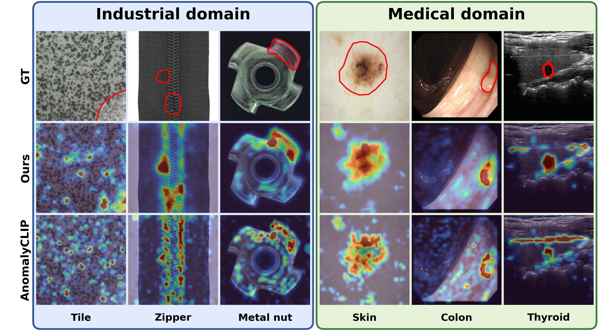

# ReMAP: Rank-Transported Re-observation via Multi-scale Affinity

**ReMAP** is a training-free method for zero-shot anomaly localization.
It keeps AnomalyCLIP frozen and improves its anomaly map through Rank
Aggregation and Transport of Evidence (RATE) and Affinity-Propagated
Re-observation (APR).

This repository is derived from the official
[AnomalyCLIP](https://github.com/zqhang/AnomalyCLIP) implementation. ReMAP does
not update model parameters, fit target-dataset statistics, or use target
labels for calibration.



## Method

RATE compares frozen patch features across scales, identifies uncommon
patches, and combines three spatial rankings. It then assigns the original
AnomalyCLIP patch scores according to this order, preserving the score values
while improving their locations.

APR uses the RATE map and fixed text descriptions to select one informative
region. The same frozen encoder observes this crop at higher resolution, and
supported crop evidence is transferred back only to the corresponding region
of the full image.

## Installation

The released configuration uses Python 3.10 and CUDA 11.8.

```bash
conda create -n remap python=3.10
conda activate remap
pip install torch==2.0.0 torchvision==0.15.1 torchaudio==2.0.1 --index-url https://download.pytorch.org/whl/cu118
python -m pip install -r requirements.txt
```

The CLIP backbone is downloaded automatically to `~/.cache/clip`. Set
`ANOMALYCLIP_MODEL_CACHE` to choose another directory.

## Checkpoints

The pretrained AnomalyCLIP prompt checkpoints are downloaded separately and
are not tracked by Git:

```bash
bash download_checkpoints.sh
```

The downloader retains only the two final checkpoints needed by ReMAP and
verifies their SHA-256 checksums.

## Dataset evaluation

Prepare datasets following [AnomalyCLIP](https://github.com/zqhang/AnomalyCLIP). Each dataset root must contain its images and an AnomalyCLIP-compatible
`meta.json`. Metadata generators accept the dataset location explicitly:

```bash
python generate_dataset_json/mvtec.py --root /path/to/mvtec
```

Run one dataset through the complete ReMAP pipeline with either a common data
directory or a dataset-specific override:

```bash
DATA_BASE=/path/to/datasets bash test_remap.sh all

# Equivalent
MVTEC_ROOT=/path/to/mvtec bash test_remap.sh mvtec
```

The runner supports `mvtec`, `visa`, `btad`, `mpdd`, `sdd`, `dagm`, `dtd`,
`isic`, `colondb`, `clinicdb`, `kvasir`, `endo`, and `tn3k`, together with the
`industrial`, `medical`, and `all` groups. Intermediate arrays are stored under
`cache/remap/`; final JSON files are stored under `results/remap/main/`.

## Single-image inference

```bash
python -m remap.infer \
  --image_path /path/to/image.png \
  --checkpoint_path checkpoints/9_12_4_multiscale/epoch_15.pth \
  --class_name bottle \
  --domain industrial \
  --output_dir outputs/example
```

For medical images, use `--domain medical` and an organ name such as `skin`,
`colon`, `thyroid`, `brain`, or `chest`. The command saves the raw anomaly map,
a heatmap, and an overlay. Add `--cpu` when CUDA is unavailable.

## Results

The retained results use category-macro pixel AUROC and AUPRO under the
official AnomalyCLIP evaluation protocol.

| Domain | Pixel AUROC | AUPRO |
|---|---:|---:|
| Industrial | 96.553 | 85.521 |
| Medical | 88.193 | 72.273 |

The reported domain means exclude the SDD and TN3K robustness datasets.
Per-dataset values and inclusion flags are available in
[`results/remap/main/summary.md`](results/remap/main/summary.md).

## License and citation

The inherited AnomalyCLIP code is distributed under the MIT license in
[`LICENSE`](LICENSE), with attribution recorded in [`NOTICE.md`](NOTICE.md).
Dataset licenses remain with their respective owners.

ReMAP citation information will be added when the paper record is public.
